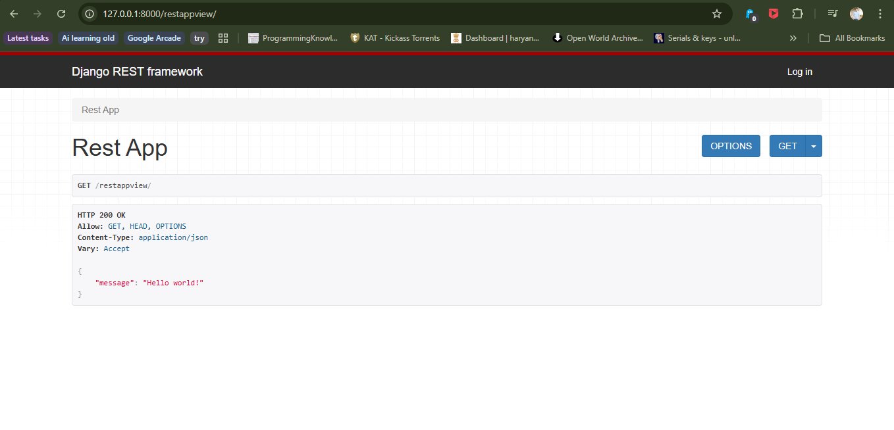
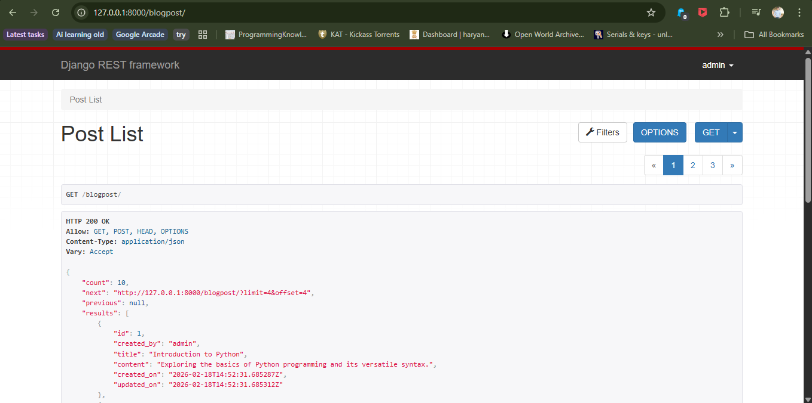
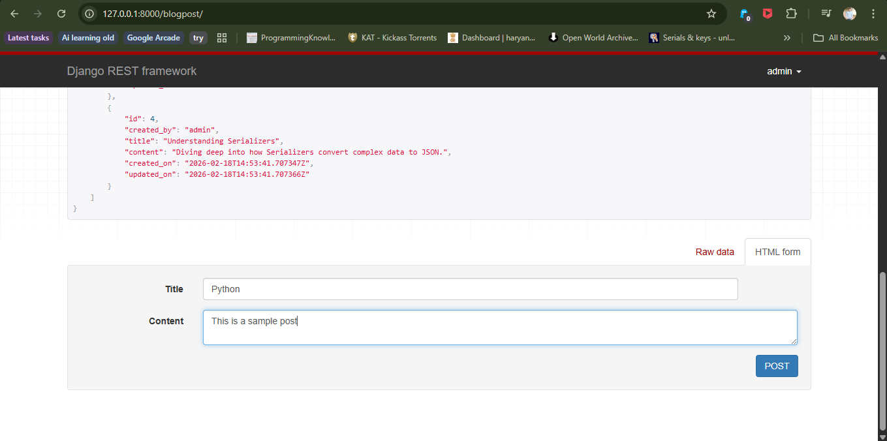
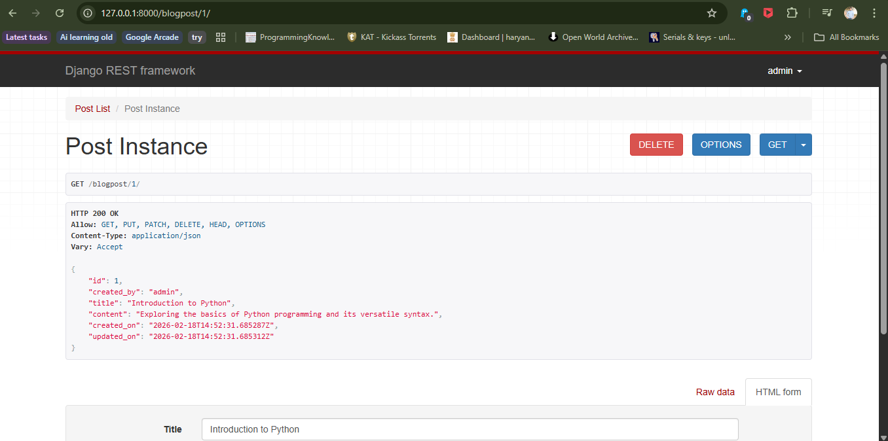
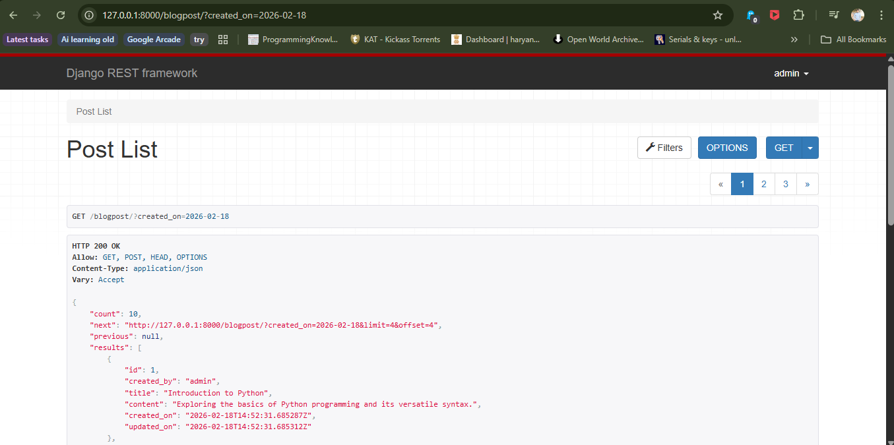
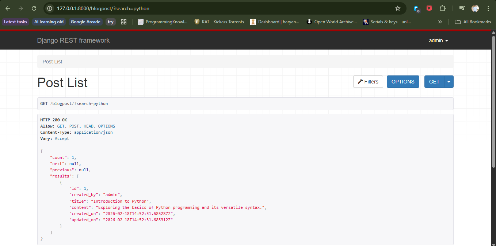
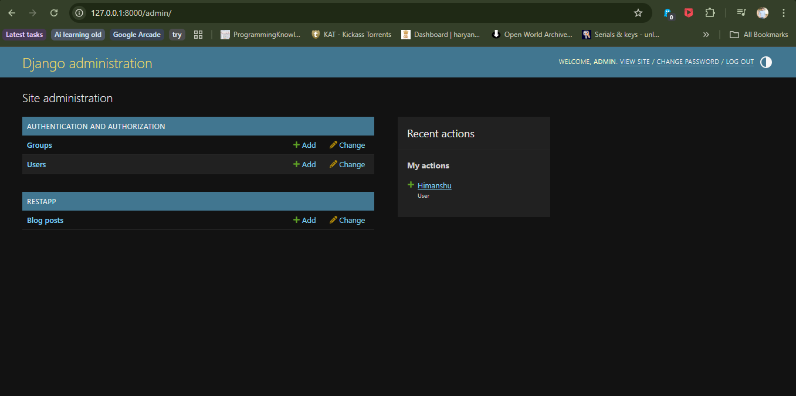

# Assignment 9: REST API Using Django

## REST API's Using Django

A complete RESTful API built using Django REST Framework for managing blog posts with authentication, permissions, filtering, searching, and pagination.

---

## 📌 Project Overview

### Description
A fully functional REST API application that allows authenticated users to create, read, update, and delete blog posts. The API includes user authentication, custom permissions, advanced filtering by date, search functionality, ordering, and pagination.

### Features
- ✨ Complete CRUD operations for blog posts
- 🔐 User authentication and authorization
- 🛡️ Custom permissions (users can only modify their own posts)
- 🔍 Search functionality by title and content
- 📅 Filter posts by creation date
- 📊 Ordering by post ID
- 📄 Pagination with limit/offset
- 👤 User-specific post retrieval
- ⚡ Django Admin integration for managing posts

---

## 📂 Project Structure
```
assignment9-REST_API_Using_Django/
├── blog/
│   ├── blog/
│       ├── __init__.py
│       ├── settings.py              # Django settings with REST framework config
│       ├── urls.py                  # Main URL configuration
│       ├── wsgi.py
│       └── asgi.py
│   ├── restapp/
│       ├── __init__.py
│       ├── models.py                # BlogPost model
│       ├── views.py                 # API views and viewsets
│       ├── serializers.py           # Data serializers
│       ├── permissions.py           # Custom permission classes
│       ├── filters.py               # Custom filter classes
│       ├── admin.py                 # Admin panel configuration
│       ├── apps.py
│       ├── tests.py
│       └── migrations/
│   ├── db.sqlite3                   # SQLite database
│   ├── manage.py                    # Django management script
│   ├── screenshots/
│       ├── api_hello_world.png
│       ├── post_list.png
│       ├── post_create.png
│       ├── post_detail.png
│       ├── post_filter.png
│       ├── post_search.png
│       └── admin_panel.png
│   └── README.md                    # This documentation file
```

---

## 🚀 How to Run

### Prerequisites
- Python 3.x installed
- Django and Django REST Framework

### Installation Steps

1. **Install required packages**:
```bash
pip install django
pip install djangorestframework
pip install django-filter
```

2. **Apply migrations**:
```bash
python manage.py makemigrations
python manage.py migrate
```

3. **Create a superuser** (for admin access):
```bash
python manage.py createsuperuser
```

4. **Run the development server**:
```bash
python manage.py runserver
```

5. **Access the API**:
```
Main API: http://127.0.0.1:8000/
Hello World: http://127.0.0.1:8000/restappview/
Blog Posts: http://127.0.0.1:8000/blogpost/
Admin Panel: http://127.0.0.1:8000/admin/
API Auth: http://127.0.0.1:8000/api-auth/login/
```

---

## 💻 API Endpoints

| Endpoint | Method | Description | Authentication Required |
|----------|--------|-------------|------------------------|
| `/restappview/` | GET | Returns "Hello world!" message | No |
| `/blogpost/` | GET | List all posts by current user | Yes |
| `/blogpost/` | POST | Create a new blog post | Yes |
| `/blogpost/{id}/` | GET | Retrieve a specific post | Yes |
| `/blogpost/{id}/` | PUT | Update a specific post | Yes (Owner only) |
| `/blogpost/{id}/` | PATCH | Partially update a post | Yes (Owner only) |
| `/blogpost/{id}/` | DELETE | Delete a specific post | Yes (Owner only) |

---

## 📸 Screenshots

### API Hello World Response


*Simple GET endpoint returning JSON response*

---

### Blog Post List


*Paginated list of blog posts for authenticated user*

---

### Create Blog Post


*POST request to create a new blog post*

---

### Blog Post Detail


*GET request showing individual post details*

---

### Filter by Date


*Filtering posts by creation date*

---

### Search Posts


*Searching posts by title or content*

---

### Admin Panel


*Django admin interface for managing blog posts*

---

## 🛠️ Technologies Used

- **Python 3.x**
- **Django 6.0.2** - Web framework
- **Django REST Framework** - RESTful API toolkit
- **django-filter** - Advanced filtering support
- **SQLite** - Database (default)

---

## 🔧 Key Components

### Models (models.py)
- **BlogPost Model**
  - `title` - CharField(max_length=200)
  - `content` - TextField
  - `created_on` - DateTimeField (auto_now_add=True)
  - `updated_on` - DateTimeField (auto_now=True)
  - `created_by` - ForeignKey to User

### Serializers (serializers.py)
- **PostSerializer**
  - Serializes BlogPost model
  - Custom `created_by` field showing username
  - Automatic user assignment on creation
  - Read-only fields for security

### Views (views.py)
- **RestAPPView** - Simple APIView returning "Hello world!"
- **PostView** - ModelViewSet with:
  - CRUD operations
  - User-specific queryset filtering
  - Search, filter, and ordering backends
  - Custom permissions

### Permissions (permissions.py)
- **IsPostPossessor** - Custom permission class
  - Allows read access to all authenticated users
  - Restricts write/delete to post owner only

### Filters (filters.py)
- **PostFilter** - Custom filter for date-based filtering
  - Filter by exact creation date

### URL Configuration (urls.py)
- Admin panel route
- API authentication routes
- Simple router for blogpost viewset
- Custom API view route

---

## 🔑 Key Concepts Implemented

### Django REST Framework Fundamentals
- APIView and ModelViewSet
- Serializers for data transformation
- Custom permissions
- Authentication and authorization
- ViewSet routing with SimpleRouter

### Advanced Features
- Custom permission classes (`IsPostPossessor`)
- DjangoFilterBackend integration
- SearchFilter for text search
- OrderingFilter for sorting
- LimitOffsetPagination
- User-based queryset filtering
- Automatic user assignment on post creation

### Security
- Authentication required for all operations
- Object-level permissions
- CSRF protection
- User-specific data isolation

---

## 💡 Learning Objectives

- Building RESTful APIs with Django REST Framework
- Creating and using ModelViewSets
- Implementing custom serializers
- User authentication and authorization
- Creating custom permission classes
- Advanced filtering and search functionality
- Implementing pagination
- Using Django admin for data management
- Handling foreign key relationships
- Request context in serializers
- URL routing with routers

---

## 📁 Files

- `blog/settings.py` - Django settings with REST framework configuration
- `blog/urls.py` - Main URL routing configuration
- `restapp/models.py` - BlogPost model definition
- `restapp/serializers.py` - PostSerializer for API responses
- `restapp/views.py` - API views and viewsets
- `restapp/permissions.py` - IsPostPossessor custom permission
- `restapp/filters.py` - PostFilter for date filtering
- `restapp/admin.py` - Admin panel configuration
- `README.md` - This documentation file
- `screenshots/` - API screenshots and examples

---

## 📦 Requirements.txt
```
Django==6.0.2
djangorestframework==3.14.0
django-filter==23.3
```

---

## 👤 Author

[Himanshu Arya]  
Created as part of the TuteDude Python Programming Course

---

## 📄 License

This project is for educational purposes as part of the TuteDude Python course.